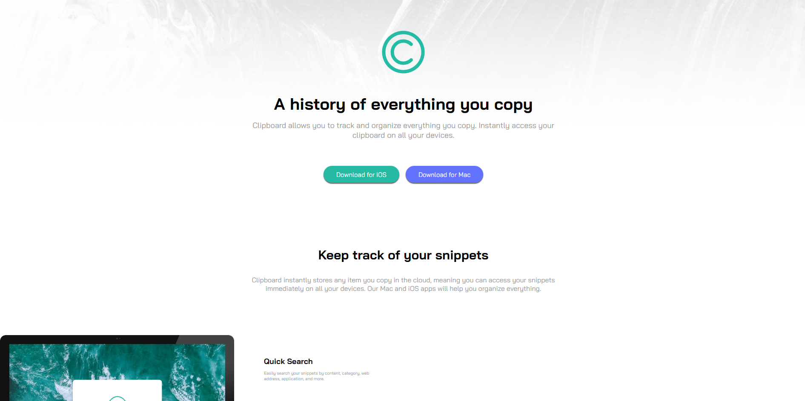

# Landing page 🖥
<p align="center">

</p>

## 📖 Sobre   
O projeto dessa landing page, foi feito com intuito de testar meu responsivo e principalmente displays, ultilizei tecnologia de CSS3 e HTML5
---

## 🚀 Tecnologias e ferramentas utilizadas
 - **HTML5**
 - **CSS3**

---

## 🖥️ Demonstração


Você pode acessar o projeto clicando [aqui](https://jeanruf1.github.io/clipboard-landing-page-master/).

---

## 🔧 Como executar o projeto

```bash
# Clone o repositório
git clone https://jeanruf1.github.io/clipboard-landing-page-master//

# Entre no diretório
cd landing-page
```
Depois disso, utilize uma ferramenta como o [Live Server](https://marketplace.visualstudio.com/items?itemName=ritwickdey.LiveServer) para criar um servidor local e executar o projeto.

----

**Desenvolvido com ❤️ por [Jean Rufino](https://github.com/jeanruf1/).**
